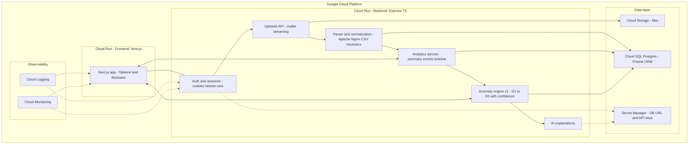

---
# Logsleuth — Full-Stack Cybersecurity Log Analyzer
---
**Test login (or create a new profile):**
`admin@gmail.com` / `admin123`

## Overview

Logsleuth is a full-stack web app for uploading heterogeneous logs (CSV/TXT/Apache/Nginx), parsing them into a normalized schema, and giving a SOC-friendly view of activity: summaries, time-series, searchable event tables, a narrative timeline, and a first-pass anomaly engine with human-readable explanations.

### What’s implemented (highlights)

* **Auth (minimal):** login + create profile (username, email, password).
* **Upload pipeline:** accepts **.csv** and **.txt**; large files streamed; stored; parsed to DB.
* **Parsers & normalization:**

  * **Web server logs:** Apache **Common** (CLF), **Combined**, and typical **Nginx** access logs.
  * **CSV:** Zscaler-style + “similar” variants via **heuristic column mapping** (auto-infer roles like timestamp, ip, status, bytes, url/domain, ua, etc.).
  * Normalized to one `Event` schema (timestamps, actors, network fields, URL parts, bytes, UA, referrer, + raw line).
* **Analytics UI (Next.js):**

  * **Summary tab:** “Events over time” with **user-selectable buckets** (1/5/10/15/30/60m), **zoom**/pan brush, top source IPs, top domains/paths, methods/status, bytes percentiles.
  * **Events tab:** paginated & filterable (method, status, text search, time range).
  * **Timeline tab:** same filters + pagination for a readable, chronological feed.
* **Anomaly engine v1 (deterministic):** request-rate spikes, rare domains, status error bursts, egress outliers, impossible travel; per-anomaly confidence; human-readable reasons.
* **AI explanations:** LLM-backed anomaly explanations & upload summary when an API key is present; deterministic templates when not.
* **Deployment:** Deployed on Google Cloud Platform (GCP).

---

## Run it Locally

### Prerequisites

* Docker Desktop (Compose v2) installed and running
* Git installed

1. Clone repository

```powershell
git clone <YOUR_REPO_URL>
cd logsleuth
```

2. Prepare backend environment file (do NOT commit)
   Create [`backend/.env`](backend/.env) and set secrets locally. Example (replace OPENAI\_API\_KEY and JWT\_SECRET):

```powershell
@"
PORT=4000
FRONTEND_ORIGIN=http://localhost:3000
UPLOAD_DIR=./data/uploads
OPENAI_API_KEY=REPLACE_WITH_YOUR_KEY
OPENAI_MODEL=gpt-4o-mini
JWT_SECRET=replace-with-a-strong-secret
"@ | Out-File -Encoding utf8 backend\.env
```

3. Start all services (build images and run containers)

```powershell
docker compose -f infra/docker-compose.yml up --build -d
```

4. Run Prisma migrations (apply DB schema to the local Postgres container)

```powershell
# wait until postgres healthy, then:
docker compose exec backend pnpm prisma migrate deploy --schema=prisma/schema.prisma
docker compose exec backend pnpm prisma generate --schema=prisma/schema.prisma
```

5. Verify services (URLs / ports)

* Frontend: [http://localhost:3000](http://localhost:3000)
* Backend API: [http://localhost:4000](http://localhost:4000)
* Postgres (host): localhost:5432
* Postgres UI (pgweb): [http://localhost:8081](http://localhost:8081)

6. Useful commands (logs, rebuild, stop)

```powershell
# follow backend logs
docker compose logs -f backend

# rebuild one service (frontend)
docker compose build frontend
docker compose up -d frontend

# stop and remove containers + volumes
docker compose -f infra/docker-compose.yml down --volumes --remove-orphans
```

7. Notes and cautions

* [`backend/.env`](backend/.env) contains secrets — do not commit it.
* Docker Compose is configured to build images (no host mounts). Changes to source require rebuilding images (see step 6).
* The compose file exposes Postgres on localhost:5432 and pgweb on 8081 (pgweb uses port 8081 in infra/docker-compose.yml).
* If you change NEXT\_PUBLIC\_API\_BASE for local testing, update the frontend service env in [`infra/docker-compose.yml`](infra/docker-compose.yml) or rebuild with a build-arg in the frontend Dockerfile.

---

## Architecture + How it flows



**Flow:**

1. **Upload:** user posts a `.csv`/`.txt`. File is streamed to local storage (GCS later) and an `Upload` row is created.
2. **Parse & normalize:** content is sniffed → a parser is chosen (Apache/Nginx preset or CSV). For CSVs, a heuristic **column role detector** infers the mapping. Rows become normalized `Event`s (with derived URL parts & safe nulls).
3. **Analytics:** the UI calls REST endpoints for **summary** (totals, top lists, p-tile bytes, **bucketed time-series**) and **events/timeline** (filters + pagination).
4. **Anomalies v1:** deterministic detectors run over the upload, writing `Anomaly` rows with `reasonText` and `confidence`. If AI (OpenAI API key present) is enabled, the reason/summary is **upgraded** with natural language.
5. **Read-only UI:** charts + tables render from DB; timeline shows a narrative slice; everything is filterable.

---

## Tech Stack

* **Frontend:** Next.js (TypeScript, App Router), Tailwind CSS, Recharts (time-series with zoom brush), fetch wrapper with credentials.
* **Backend:** Node.js + Express (TypeScript), Helmet, CORS, cookie-based auth (httpOnly), Multer for uploads.
* **ORM/DB:** Prisma + PostgreSQL; indexes on (`uploadId`, `ts`), (`uploadId`, `srcIp`), (`uploadId`, `domain`) for fast filters; percentile queries for bytes.
* **Parsers:** Regex/preset parsers for Apache/Nginx; CSV reader with **delimiter sniff + header/no-header detection + column role heuristics**.
* **AI (Model: gpt-4o-mini):** provider interface; OpenAI if `OPENAI_API_KEY` is set; deterministic templates otherwise.
* **Infra (local):** Docker Compose for Postgres + pgweb; backend/frontend run with pnpm; BigInt-safe JSON replacer to avoid serialization errors.
* **Deployment (GCP):** Deployed to Google Cloud Platform using Cloud Run services (frontend & backend) behind HTTPS; Cloud SQL (Postgres) for the database; Cloud Storage bucket for file uploads (local disk supported in dev); Secret Manager for credentials (DB URL, API keys); Cloud Logging/Monitoring enabled. Optional hardening: VPC Serverless Connector, and Artifact Registry/Cloud Build for containerized rollout.

---

## Anomaly math, AI usage, limitations

### Detectors (v1: deterministic, explainable)

* **D1 — Request-rate spike (by IP or user):** rolling 5-min counts vs upload baseline. Score \~ `z = (cnt - median)/MAD` (robust). Flag if `z ≥ τ1` and count ≥ min.
* **D2 — Rare domain (org/user):** frequency below rarity threshold within upload (and/or vs. recent uploads). Score rises as frequency → 0.
* **D3 — Status anomaly:** unusually high 4xx/5xx concentration for an IP/domain in a short window vs its upload-level baseline.
* **D4 — Egress outlier:** `bytesOut` per event above `p99` (or `max(p99, 5×p95)`) for the upload; also surfaces the top outliers.
* **D5 — Impossible travel:** consecutive events for same user show geo distance & time implying speed >> realistic (e.g., > 900 km/h). Uses haversine + Δt.

**Confidence:** per detector, `c_i = min(1, normalized_score)`. If multiple detectors hit, combine:
`c_final = 1 - Π (1 - c_i)` (Noisy-OR).

**Linkage:** anomalies reference the contributing `Event` (`eventId`) when applicable, so you can “View in events/timeline”.

### How AI is used (Model: gpt-4o-mini)

* **Anomaly explanations:** Given the detector context (who/what/where/when + why) we ask the model to produce a short, SOC-style reason with mitigation tips. If AI is off, a deterministic string is used.
* **Upload summary:** Turns top-N metrics (peaks, rare domains, error pockets, outliers) into a one-page brief. If AI is off, we render a structured template.

> **Privacy & guardrails:** Inputs to the model are limited to the current upload’s derived stats and a handful of representative rows; PII beyond user/email already present in logs is not added. AI is **advisory**—math still drives the detection.

### Known limitations (by design for v1)

* **Missing host in Apache “combined”:** request line is a path only. We **do not** treat `Referer` as the requested domain; when host is truly unknown, “Top domains” may be sparse. The UI falls back to **Top paths**.
* **Timezone/clock skew:** timestamps are parsed and normalized to UTC when possible; mixed timezones may require a per-upload timezone override.
* **Heuristic mapping ambiguity:** if a CSV lacks headers and columns are similar (e.g., two numeric columns), auto-mapping can be uncertain. We surface a UI mapping step when confidence is low.
* **Static thresholds:** v1 uses upload-level baselines. Actor-adaptive baselines and seasonality help (see Future Scope).

---

## Future scope — making v1 “learn” (brief)

* **Adaptive baselines (v1.5):** keep rolling per-actor/domain EWMAs, p95s, and hour-of-day/week profiles; set **dynamic thresholds** instead of fixed, reducing false positives.
* **Outlier ensemble (v2):** lightweight unsupervised models (robust z-scores, Isolation Forest) on short windows (per actor) combining rate, error ratio, egress, uniqueness.
* **Analyst feedback loop:** thumbs up/down on anomalies → `AnomalyFeedback` → optional supervised re-ranker (logistic/GBM) to boost precision where you care most.
* **Knowledgeable summaries:** pass **deltas vs baseline** and **deduped clusters** to the LLM so it prioritizes “what changed” and “what to do”, not restating raw counts.

---
